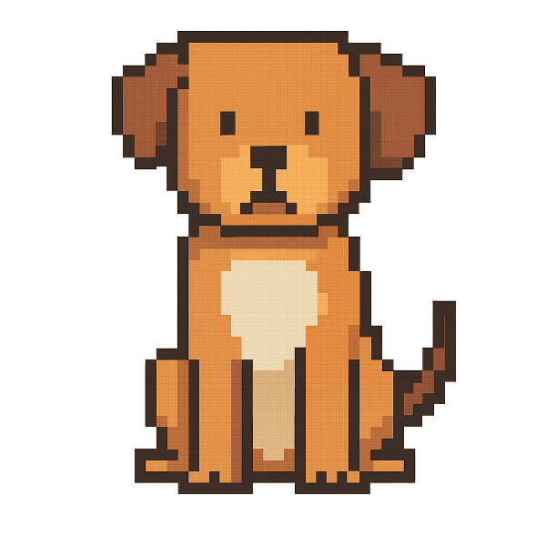

[](https://github.com/Natuworkguy/Wilco/)

# **WILCO**

**WILCO** is a pixel-perfect Pygame adventure featuring animated animals, retro-inspired visuals, and a fully custom world system. Whether you're a dev or a player, WILCO invites you into a world of charm, action, and creativity. Built with ❤️ in Python.

---

## 🎮 Features

- 🐶 Dynamic sprites for dogs & cats (idle, walk, jump, and more!)
- 🌍 Custom `.wlco` world file format
- 🖋️ Retro UI using hand-picked fonts like **Orbitron**, **ComicNeue**, and more
- 🔤 Built-in asset system with organized folders for fonts and images

---

## 🧠 Requirements

- Python 3.9+ recommended
- [`pygame`](https://www.pygame.org/)

Install dependencies:

```bash
pip install pygame
````

---

## 🚀 Getting Started

Clone the repo and start the game:

```bash
git clone https://github.com/Natuworkguy/wilco.git
cd wilco/
python main.py
```

---

## 📁 Project Structure

```
Wilco/
├── main.py               # Main game script
├── assets/
│   ├── fonts/            # Orbitron, VT323, ComicNeue, etc.
│   └── images/           # dog.png, cat.png, jump-sprites, etc.
│   └── sounds/           # bgm.mp3, and future sounds.
```

---

## ❤️ Credits
Code by [**Natuworkguy**](https://github.com/Natuworkguy),
Idea by Kath Hill
Music by Gloomy_Background755 - [MakoVII](https://github.com/OnionUI/Themes/tree/main/themes/MakoVII%20by%20Gloomy_Background755)
---

## 🪪 License

Licensed under the **GNU Affero General Public License v3.0**.
See the [LICENSE](./LICENSE) file for full details.

